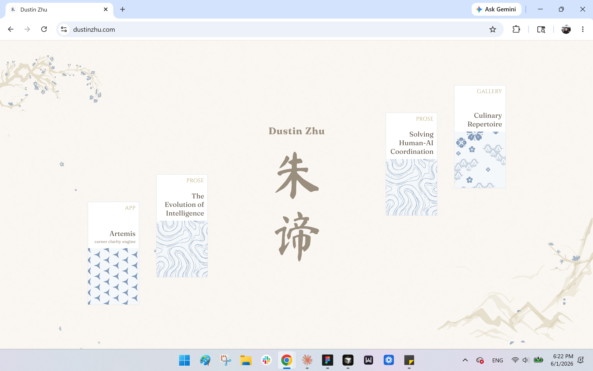
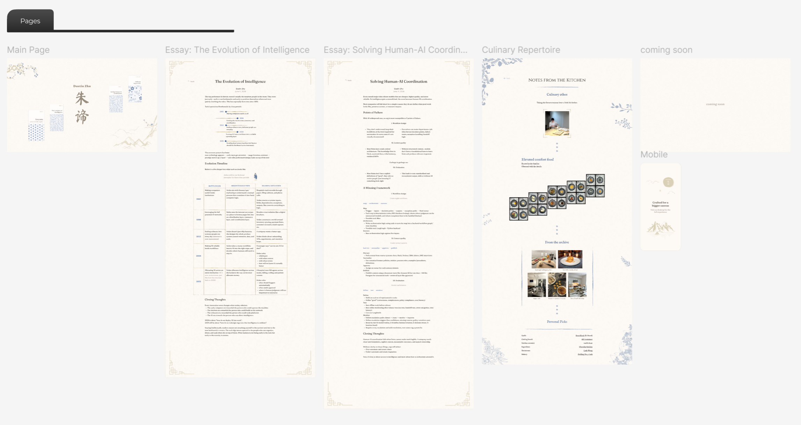
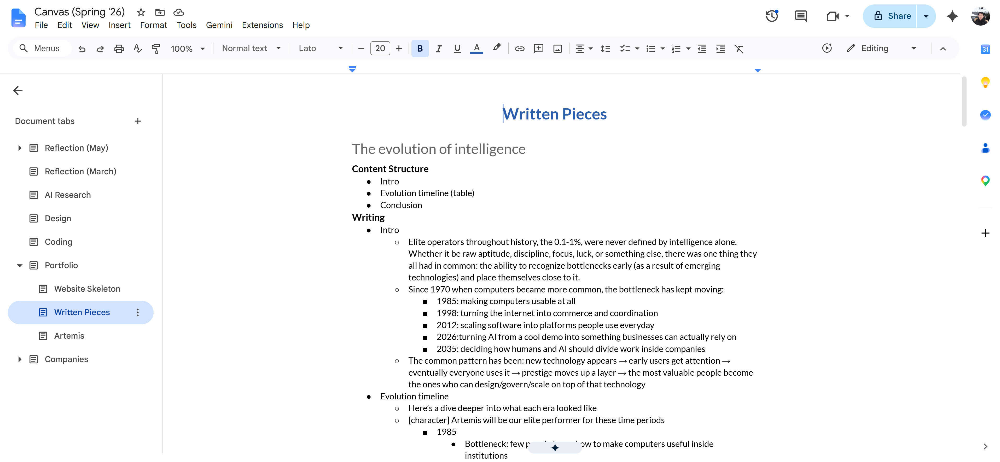
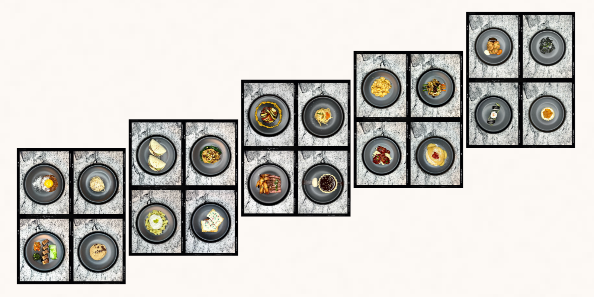
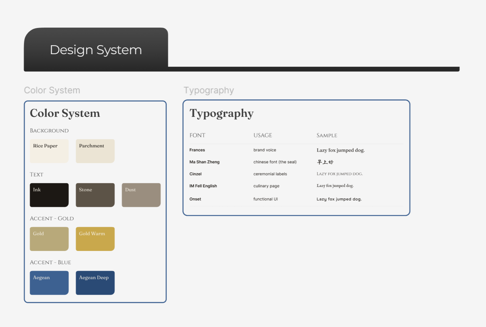

# Portfolio: Dustin Zhu

> A collection of artifacts that demonstrates design + technical expertise. The design language lives at the intersection of **chinese & greek aesthetics**: a
> parchment/calligraphic world embellished by accents of aegean blue.

**Live at [dustinzhu.com](https://dustinzhu.com)**

<p align="center">
  
</p>

---

## Table of Contents
1. [Project Overview](#project-overview)
2. [Portfolio Experience](#portfolio-experience)
   - [Homepage](#homepage)
   - [Artemis: Career Clarity Engine](#artemis-career-clarity-engine)
   - [Essays](#essays)
   - [Culinary Repertoire](#culinary-repertoire)
3. [Design & Development Process](#design--development-process)
4. [Tech Stack](#tech-stack)
5. [Project Structure](#project-structure)

---

## Project Overview

Welcome to my personal portfolio. Currently it's a collection of artifacts: **Artemis** (a career clarity engine), two **thought essays**, and a
**culinary repertoire**. The design language deliberately fuses a chinese calligraphic aura with greek/aegean motifs.

<p align="center">
  
</p>

This project showcases:
- Art direction & design systems (end-to-end visual identity)
- Front-end engineering (hand-built React app)
- Motion design (GSAP-driven micro-animations)
- Design-to-code workflow (rough draft → Figma → production code)

---

## Portfolio Experience

### Homepage

The homepage is the thesis of the entire portfolio: **an intersection of chinese and greek
aesthetics.** It starts off in a parchment world and threads in aegean blue
accents as the second cultural voice.

It's also where most of the micro-animations live (typewriter intro, name ⇄ bio hover swap, ambient life, scale-to-fit composition).

### Artemis: Career Clarity Engine

**Artemis** is a career clarity engine that helps people figure out what professional work fits them.
It lives as its own project; there will be a separated dedicated repo for this artifact.

> 🚧 **Coming soon.** The Artemis repository is in progress.

### Essays

The essays are long-form pieces (personal thoughts) on the current and future landscape of AI.

Every piece started out in google docs then moved into figma where the visual structure, design, and diagrams came to life.

<p align="center">
  
</p>

### Culinary Repertoire

I've always enjoyed cooking as a hobby and wanted to share my kitchen creations - my culinary focus has primarily been elevated comfort food.

<p align="center">
  
</p>

---

## Design & Development Process

I had the same pipeline for every surface on this site:

1. **Draft in Google Docs**: blank canvas brainstorming
2. **Design in Figma**: source of truth for everything (1440×900 desktop, 390×844 mobile); colors, type, ornaments are
   all decided here.

<p align="center">
  
</p>

3. **Code using Claude/Cursor**: thankfully MCP exists now

---

## Tech Stack

| Layer | Choice |
|---|---|
| **Framework** | React 18 + Vite |
| **Styling** | Tailwind CSS |
| **Routing** | React Router |
| **Animation** | GSAP |
| **Art** | Hand-authored SVG |
| **Hosting** | Vercel |

---

## Project Structure

```
portfolio/
├── public/                 # served as-is at the site root
│   ├── opengraph.jpg        # social share preview image
│   ├── robots.txt
│   └── sitemap.xml
├── src/
│   ├── assets/
│   │   ├── illustration/    # hand-authored SVGs (scene art, ornaments, petals)
│   │   └── image/           # raster photos (culinary .webp gallery)
│   ├── components/          # reusable pieces (EssayLayout, FallingPetals, Clouds…)
│   ├── data/                # generated data (petal spawn points)
│   ├── lib/                 # shared theme constants (fonts, palette refs)
│   ├── pages/               # one file per route (MainPage, essays, Culinary…)
│   ├── App.jsx              # router + mobile detection
│   ├── main.jsx             # entry point
│   └── index.css            # global resets, CSS variables, transitions
├── index.html              # single HTML entry (meta tags / social preview)
├── tailwind.config.js
├── vite.config.js
├── vercel.json             # SPA rewrite for deep links
└── BUILD_DNA.md            # my reusable build philosophy & standards
```

---

Thanks for visiting!
